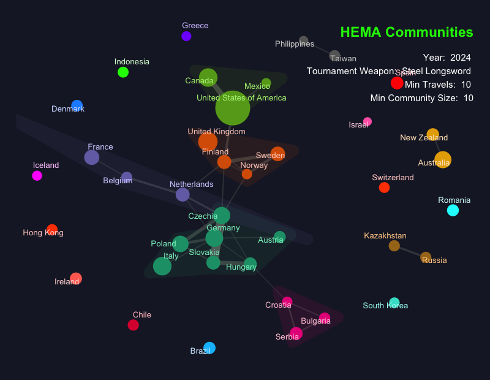

---
title: "HEMAscRaper"
output: github_document
---

`HEMAscRaper` is an R package that provides tools to work with Historical European Martial Arts (HEMA) data. It includes preloaded datasets, functions to refresh data from the HEMA Ratings website, and utilities to calculate and visualize communities in the HEMA ecosystem.

## Installation

To install the development version of the package, use:

```r
# Install devtools if not already installed
install.packages("devtools")

# Install HEMAscRaper from your GitHub repository
devtools::install_github("giannettig/HEMAscRaper")
```

## Available Datasets

The package comes with several preloaded datasets that are essential for HEMA analysis. These datasets can be accessed directly within R using the `data()` function:

### Datasets Overview

1. **hema_clubs**: Contains information about HEMA clubs, such as names and locations.
2. **hema_countries**: Provides country-level data related to HEMA, communities are calculated for Longsword up to 2024
3. **hema_events**: Includes details about tournaments and events (e.g., names, dates, locations).
4. **hema_fighters**: Contains detailed information about individual fighters.
5. **hema_fights**: Captures match-level data with fight results.
6. **hema_match_results**: Summarized match results, including competitors, scores, and outcomes.
7. **hema_tournaments**: High-level tournament data, including names, dates, and participants.
7. **hema_achievements**: Individual fencer achievements.

### Example: Loading a Dataset

```r
# Load the hema_clubs dataset
data("hema_clubs", package = "HEMAscRaper")

# View the first few rows
head(hema_clubs)
```

## Refreshing Datasets

To ensure you have the latest HEMA Ratings data, use the `refresh_hema_data()` function. This function allows you to perform a full or incremental update of the datasets.

### Usage

```r
refresh_hema_data(incremental = TRUE, path = "./hema_ratings")
```

### Parameters

- **incremental**: If `TRUE`, performs an incremental update for the fights dataset. If `FALSE`, downloads the entire fights dataset.
- **path**: Directory where the updated CSV files will be saved. Default is `"./hema_ratings"`.

### Example: Full Update

```r
# Perform a full update and save results in the "./hema_ratings" directory
refresh_hema_data(incremental = FALSE, path = "./hema_ratings")
```

## Calculating and Visualizing Communities

The package includes tools to calculate HEMA communities or "islands" based on relationships between fighters, clubs, or tournaments. These are generated using the `generate_communities_graph()` function and visualized with `visualize_communities()`.

### Generating Communities

```r
graph <- generate_communities_graph(
  year = 2024,
  tournament_weapon = "Steel Longsword",
  weight_threshold = 5,
  population_threshold = 10
)

# View filtered nodes
graph %>%
  tidygraph::activate(nodes) %>%
  tibble::as_tibble()
```

### Visualizing Communities

```r
viz <- visualize_communities(graph, year = 2024)
print(viz)
```



### Example Parameters

- **year**: Specify a single year or a range of years (e.g., `c(2023, 2024)`).
- **tournament_weapon**: Filter by specific weapons (e.g., `"Steel Longsword"`).
- **weight_threshold**: Minimum edge weight to include in the graph.
- **population_threshold**: Minimum node population size to include in the graph.

## Contribution

Contributions are welcome! If you'd like to contribute, fork the repository, make your changes, and submit a pull request.

## License

This package is distributed under the GPL-3 License.

## Acknowledgments

The package relies on the following libraries:
- `tidygraph` for graph representation and manipulation.
- `ggraph` for visualization.
- `dplyr` and `tibble` for data manipulation.
- `stringr` for string handling.

We appreciate the support of the HEMA community in providing data for analysis and research.
